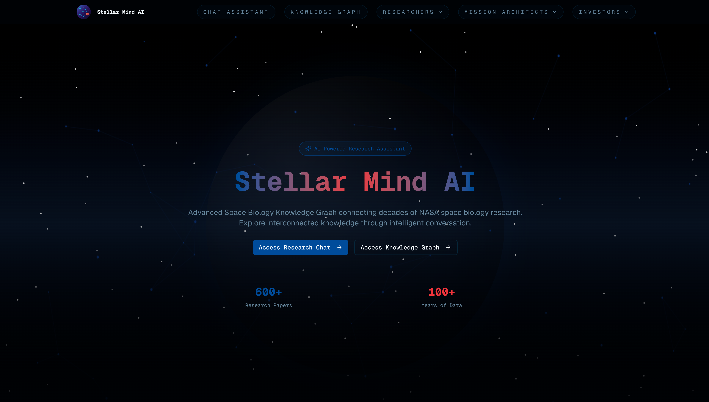
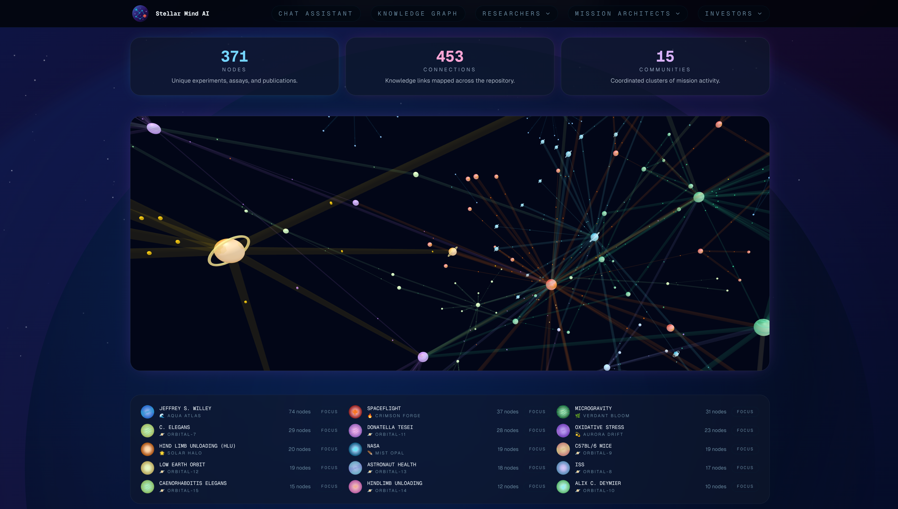
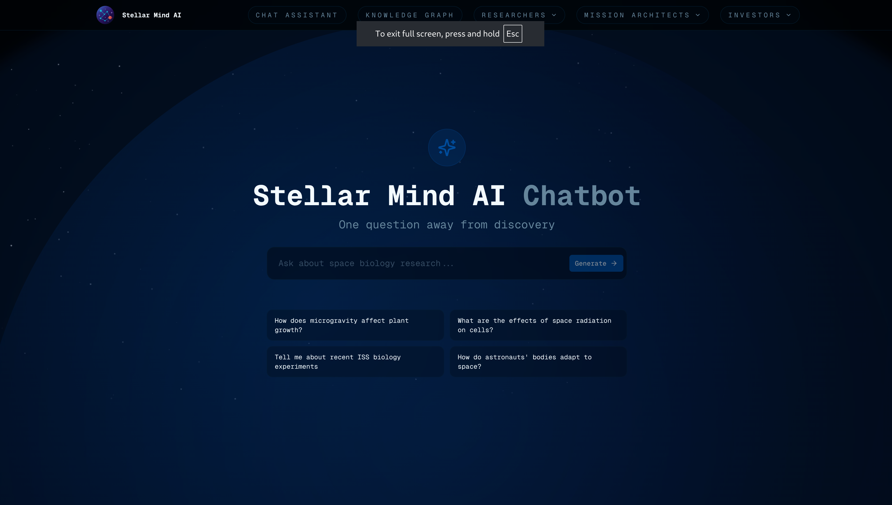
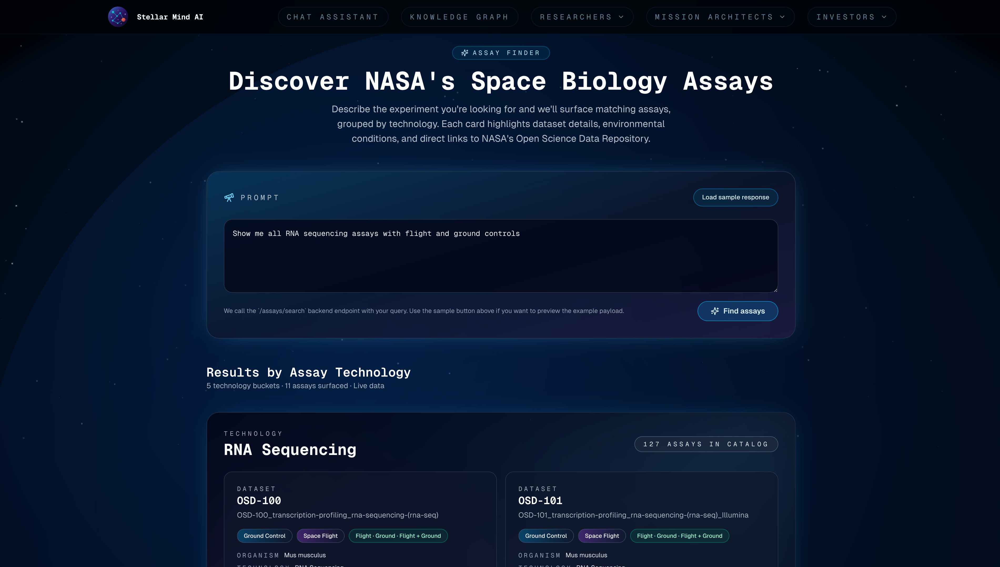
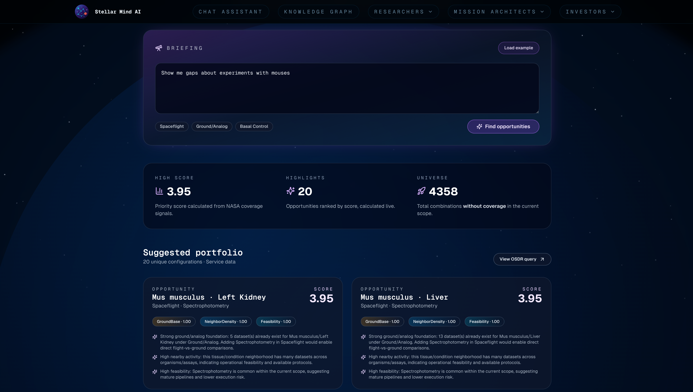

# Stellar-Minds 🚀🧠

> Ecosistema NASA Space Apps que combina un backend inteligente basado en GraphRAG con un frontend inmersivo (nasa-space-biology) para descubrir, conversar y accionar conocimiento en biología espacial.

## 📡 Qué es Stellar-Minds
Stellar-Minds nació como respuesta a un reto recurrente en la comunidad científica: extraer significado de décadas de experimentos de biología espacial dispersos en el Open Science Data Repository (OSDR) de la NASA. Nuestro proyecto crea una **plataforma cognitiva** que actúa como copiloto científico: entiende preguntas en lenguaje natural, identifica vacíos de investigación, genera respuestas apoyadas en grafos de conocimiento y ofrece una interfaz visual que muestra cómo se interconectan los hallazgos.

El corazón técnico está en `api/`, un backend FastAPI que orquesta proveedores de IA, conectores NASA y un chatbot GraphRAG. La experiencia de usuario vive en `nasa-space-biology/`, un frontend Next.js 15 animado con gráficos interactivos y componentes Radix/Tailwind que permiten navegar resultados, iniciar chats y visualizar el grafo de relaciones.

## 🧭 Experiencia End-to-End
1. **Exploración visual**. El sitio web nasa-space-biology despliega un hero animado con partículas y un canvas de grafo que introduce el universo de conceptos (microgravedad, radiación, tejidos, fases de vuelo).
2. **Descubrimiento guiado**. El módulo "Advanced Research Capabilities" resume lo que el motor ofrece: insights con LLM, navegación basada en grafos, base de datos integral y análisis en tiempo real.
3. **Interacción conversacional**. El visitante accede a `/chat`, donde el componente `ChatInterface` abre una sesión con el backend, mantiene historial en memoria, sugiere preguntas y refleja latencia en vivo.
4. **Búsqueda especializada**. A través de `/assay-finder` y futuros paneles, el frontend llama a `GET /api/v1/assays/search` para traducir preguntas como "experimentos de microgravedad en ratones" en filtros OSDR válidos.
5. **Detección de brechas**. El módulo gap finder expone combinaciones organismo/tejido/condición ausentes, ayudando a planificar nuevas misiones científicas.

Cada interacción está respaldada por respuestas JSON consistentes que sirven por igual al frontend, notebooks científicos o integraciones de terceros.

## 🖥️ nasa-space-biology: Frontend inmersivo
- **Framework principal**: Next.js 15 con React 19 y TypeScript (`nasa-space-biology/app`).
- **Estilo y UI**: Tailwind CSS v4, variaciones de Shadcn UI (Radix + tailwind-merge + class-variance-authority) y animaciones personalizadas (`animate-pulse-glow`).
- **Componentes destacados**:
  - `Hero`: escena con partículas generativas en canvas, estadísticas de corpus y CTA hacia el chat y el grafo.
  - `KnowledgeGraph`: simulación canvas que muestra nodos dinámicos (microgravedad, radiación, crecimiento vegetal) y cómo orbitan alrededor de "Space Biology".
  - `ChatInterface`: experiencia tipo copiloto (estilo Dora AI) que crea chats on-demand, gestiona errores y mantiene conversaciones con scroll inteligente.
  - `SpaceBackground`: capa visual para el área de chat con nebulosas animadas (ver `components/space-background.tsx`).
- **Contexto de datos**: `APIContext.tsx` centraliza llamadas HTTP con Axios, soporta múltiples endpoints (`chat`, `assays`, `wikis`, etc.) y permite configurar el backend mediante `NEXT_PUBLIC_BACKEND_URL`.
- **Graph Explorer**: ruta `/graph` preparada para integrarse con `react-force-graph`, `three.js` y renders 3D de comunidades GraphRAG.
- **Acceso controlado**: sección CTA enfatiza acceso para personal autorizado, con botones para solicitar credenciales o contactar al equipo.

> ✨ Resultado: un portal que no solo informa, sino que inspira a explorar, formando puente entre científicos, inversores y arquitectos de misión.

## ⚙️ Backend API (FastAPI + GraphRAG)
- **`api/app.py`**: inicia la aplicación, configura CORS con el dominio Vercel (`vercel-app-frontend-tawny.vercel.app`) e inyecta en el `lifespan` el `ChatService` y el `OpenAIProvider`.
- **Chat conversacional** (`api/graphbot/`):
  - `GraphRAGBot` envía consultas a `run_local_search`, `run_global_search` o `run_drift_search` (GraphRAG CLI) y opera en hilos (`asyncio.to_thread`) para no bloquear el loop asíncrono.
  - `ChatService` crea y gestiona historiales en `MemoryStore` (concurrencia protegida por `threading.RLock`).
  - Excepciones como `ChatBusyError` responden con `409 Conflict`, asegurando UX consistente en el frontend.
- **Assay Finder** (`api/assay_finder/router.py`):
  - `GetFilterPrompt` convierte texto libre en JSON de filtros (organismo, condición, regex de assay/tecnología, dataset).
  - Usa `httpx.AsyncClient` para consultar OSDR (`visualization.osdr.nasa.gov`).
  - Deduplica resultados, calcula flags `has_flight`/`has_ground` y genera enlaces HTML a datasets.
- **Gap Finder** (`api/gap_finder/router.py`):
  - Normaliza tejidos, condiciones y presencia de datos para identificar zonas sin cobertura experimental.
  - Devuelve listas únicas para poblar componentes UI (selectores y filtros avanzados).
- **Proveedor de IA** (`api/ai/providers/openai_provider.py`):
  - Encapsula llamadas a `gpt-3.5-turbo`, `gpt-4` y `gpt-4o`, aplicando formateadores personalizados (`OpenAIFormatter`).
  - Expone `get_active_models` para UI dinámicas en el frontend.

## 🔄 Flujo de Inteligencia
1. Usuario lanza consulta desde la web o API REST.
2. FastAPI crea el contexto con claves OpenAI (`OPENAI_API_KEY`) y ruta GraphRAG (`APP_BACK_GRAPHRAG_ROOT`).
3. Los prompts especializados (`GetFilterPrompt`, `GetGapFilterPrompt`) producen filtros reproducibles.
4. GraphRAG o APIs NASA suministran contenido bruto.
5. Los datos se enriquecen (condiciones, enlaces, flags de vuelo) y se devuelven al frontend.
6. El frontend renderiza chat, tarjetas, gráficos o visualizaciones 3D según corresponda.

## 💡 Innovación que aporta valor
- **Traducción semántica→estructurada** 🧬: investigadores escriben como hablan; el sistema responde con filtros precisos listos para pipelines científicos.
- **Grafo + narrativa** 🌐: GraphRAG crea narrativas respaldadas por grafos de conocimiento, permitiendo citar contextos y relaciones.
- **Visual-first** 🎨: nasa-space-biology utiliza canvases animados, datos en vivo y grafos interactivos para mantener a la audiencia inmersa.
- **Orquestación híbrida** 🤝: combina APIs públicas de la NASA, infraestructura propia y servicios IA externos con un diseño extensible (futuros LLMs open source, bases persistentes, dashboards adicionales).
- **Descubrimiento de brechas** 🕳️: el gap finder prioriza misiones mostrando qué combinaciones (organismo, tejido, condición) aún no se han estudiado.

## 🧪 Casos de uso en detalle
- **Planificación de experimentos**: seleccionar tecnologías de secuenciación con historial de vuelo y condiciones comparables para nuevas misiones ISS.
- **Revisión rápida de literatura**: chat GraphRAG resume hallazgos y enlaza con datasets relacionados sin salir del navegador.
- **Auditoría de cobertura**: gap finder refleja dónde faltan datos ground-control, orientando a agencias y universidades.
- **Onboarding científico**: nuevos investigadores exploran el grafo, leen tarjetas y reciben guías conversacionales en español o inglés.
- **Presentaciones ejecutivas**: la UI estilizada comunica valor a stakeholders no técnicos con métricas y visualizaciones claras.

## 6. Funcionalidades del Sistema
El proyecto Stellar Mind AI está diseñado para ofrecer una experiencia de exploración científica accesible, visual e inteligente. Su arquitectura modular permite que distintos perfiles de usuario —desde investigadores hasta arquitectos de misiones— interactúen con la misma base de conocimiento desde perspectivas diferentes, adaptando las funcionalidades a sus necesidades específicas.

### Funcionalidades Generales
Estas herramientas constituyen el núcleo común de la aplicación y son compartidas por todos los usuarios del sistema.
- **Chatbot de consulta en lenguaje natural**: un asistente virtual impulsado por modelos de lenguaje (LLMs) que responde preguntas, resume estudios, identifica conexiones entre investigaciones y sugiere fuentes relevantes. Gracias a la integración con el grafo semántico, las respuestas reflejan relaciones conceptuales y contextuales, ofreciendo una comprensión científica más profunda que una búsqueda textual tradicional.
- **Visualización interactiva del grafo de conocimiento**: módulo web que representa conceptos, entidades y relaciones extraídas de los 608 documentos biológicos de la NASA. A través de la interfaz interactiva desarrollada en React, es posible navegar el grafo, filtrar por temática o entidad y descubrir conexiones emergentes entre experimentos, resultados y organismos.

### Funcionalidades específicas por perfil
Para maximizar el impacto y la aplicabilidad del sistema, Stellar Mind AI ofrece tres conjuntos de herramientas adaptadas a perfiles clave dentro del ecosistema científico y tecnológico de la exploración espacial.

#### Investigador – “Assay Finder”
El módulo Assay Finder facilita el acceso a información experimental de forma sencilla y rápida. Permite buscar experimentos, metodologías, resultados o condiciones de misión sin conocer la estructura interna de las APIs de la NASA. El sistema interpreta consultas complejas, localiza experimentos relevantes y ofrece resúmenes estructurados con tipo de ensayo, resultados clave, condiciones de microgravedad, organismos estudiados y conclusiones principales, acelerando la revisión de literatura y la formulación de nuevas hipótesis.

#### Inversor – “Investment Radar” y “Gap Finder”
Conjunto orientado a usuarios interesados en la gestión estratégica de la investigación y la innovación.
- **Investment Radar** identifica áreas emergentes y tendencias de investigación biocientífica espacial mediante el análisis de co-ocurrencias, evolución temporal de conceptos y densidad de publicaciones. Ayuda a detectar campos de alto potencial científico o tecnológico, apoyando decisiones de inversión y asignación de recursos.
- **Gap Finder** analiza las relaciones del grafo para detectar vacíos de conocimiento, combinaciones de variables biológicas sin estudio o lagunas en resultados experimentales. Ofrece recomendaciones proactivas sobre líneas de investigación futuras, promoviendo la innovación científica y la colaboración interdisciplinaria.

#### Arquitecto de Misiones – “Risk Lens”
Módulo diseñado para apoyar la planificación segura y eficiente de misiones espaciales. A partir de consultas en lenguaje natural, identifica riesgos biológicos o experimentales asociados a radiación, microgravedad, aislamiento o estrés ambiental. Mediante inferencias del grafo, Stellar Mind AI enlaza estudios previos con factores de riesgo relevantes, ayudando a anticipar problemas y diseñar contramedidas informadas. Contribuye directamente a la seguridad y sostenibilidad de futuras misiones lunares y marcianas.

En conjunto, estas funcionalidades hacen de Stellar Mind AI una plataforma versátil, interactiva y científicamente sólida que integra la potencia de la inteligencia artificial con la exploración del conocimiento biológico espacial, alineándose con la visión de la NASA de una ciencia abierta, colaborativa y orientada al futuro.

## 7. Resultados y demostración
El proyecto Stellar Mind AI, desarrollado por el equipo Stellar Minds, culmina en una aplicación web funcional que combina una base de conocimiento procesada mediante GraphRAG, un chatbot inteligente y una visualización interactiva del grafo de conocimiento. Los resultados demuestran la capacidad del sistema para integrar información compleja, generar respuestas útiles y ofrecer una exploración visual intuitiva de los datos biológicos espaciales.

### Interfaz general y visualización del conocimiento
La URL pública para acceder a esta funcionalidad es: LINK
La interfaz principal presenta un dashboard dinámico donde el usuario puede alternar entre los modos de chat conversacional y visualización del grafo.
- Chat conversacional: interacción en lenguaje natural con la base de conocimiento.
- Visualización del grafo: exploración de nodos, relaciones y clústeres de información.





### Ejemplos de consultas y respuestas del chatbot
La URL pública para acceder a esta funcionalidad es: LINK
El chatbot demuestra la capacidad de realizar inferencias basadas en el grafo, ofreciendo respuestas fundamentadas y referencias a estudios originales.

Estas respuestas no se limitan a extraer texto literal, sino que combinan información de diferentes documentos y razonan sobre relaciones científicas presentes en el grafo.

### Casos de uso por perfil de usuario
La URL pública para acceder a esta funcionalidad es: LINK

Investigador – Assay Finder


Inversor – Investment Radar / Gap Finder


Arquitecto de Misiones – Risk Lens


### Evaluación cualitativa de rendimiento y utilidad
Durante las pruebas internas, Stellar Mind AI mostró un alto grado de coherencia semántica y relevancia contextual en las respuestas generadas. El sistema responde con fluidez a consultas complejas e integra resultados de múltiples documentos, evidenciando la eficacia del enfoque GraphRAG para representar conocimiento científico. La visualización del grafo identifica zonas densas de investigación y vacíos de conocimiento, aportando valor a científicos y gestores de innovación.

Desde la perspectiva del usuario, las principales fortalezas observadas son:
- Facilidad de uso: interacción natural sin requerir conocimientos técnicos.
- Interpretabilidad: las relaciones y fuentes se visualizan de manera transparente.
- Versatilidad: la herramienta se adapta a distintos perfiles y casos de uso.

Los resultados confirman que Stellar Mind AI constituye una solución innovadora, práctica y escalable para transformar el conocimiento biológico espacial en una red de información accesible, comprensible y útil para la comunidad científica y tecnológica.


## 🛠️ Puesta en Marcha Técnica
### 1. Requisitos previos
- Python 3.10+
- Node.js 20+ y npm/pnpm
- Clave de OpenAI (`OPENAI_API_KEY`)
- Datos GraphRAG preparados (`APP_BACK_GRAPHRAG_ROOT` apuntando al repositorio de conocimiento)

### 2. Backend (`api/`)
```bash
cd api
pip install -r requirements.txt
uvicorn app:app --host 0.0.0.0 --port 8000 --reload
```
Variables sugeridas (`api/.env`):
```env
OPENAI_API_KEY="sk-..."
APP_BACK_STORE=memory
APP_BACK_CHATBOT=graphrag
APP_BACK_GRAPHRAG_ROOT=/ruta/a/graphrag
```

### 3. Frontend (`nasa-space-biology/`)
```bash
cd nasa-space-biology
npm install   # o pnpm install
npm run dev   # Levanta en http://localhost:3000
```
Variables `.env.local`:
```env
NEXT_PUBLIC_BACKEND_URL=http://localhost:8000
NEXT_PUBLIC_GRAPH_BASE=http://localhost:8000/api/v1
```
> Consejo: el `APIContext` soporta dominios externos, por lo que basta con cambiar las variables para apuntar a entornos de staging o producción.

### 4. Pruebas manuales recomendadas
- Visitar `http://localhost:3000` y explorar la landing animada.
- Abrir `/chat`, enviar preguntas y observar el streaming de respuestas (metodo por defecto `local`).
- Consumir `GET /api/v1/assays/search?q=spaceflight+mouse` desde el navegador o Postman.
- Verificar el grafo en `/graph` y futuros paneles de gap analysis.

## 📂 Estructura del Repositorio
- `api/`: backend FastAPI con módulos `graphbot`, `assay_finder`, `gap_finder`, `ai`.
- `nasa-space-biology/`: frontend Next.js con rutas `app/`, componentes UI y gráficas interactivas.
- `AzuriteConfig/`, `api/.env`, `resources/`: configuraciones adicionales y datasets de soporte.

## 🔒 Configuración y Seguridad
- Claves API gestionadas vía dotenv; no se exponen en el frontend.
- `withCredentials` habilitado en Axios para soportar flujos autenticados.
- CORS restringido al dominio Vercel de producción, mitigando orígenes no autorizados.
- Preparado para incluir OAuth/cookies en `APIContext` con `Authorization: Bearer`.

## 🛤️ Roadmap
- Persistencia (PostgreSQL o vector store) para historiales y seguimiento de métricas.
- Integración de LLMs open source para despliegues soberanos y modo offline.
- Paneles visuales de brechas con gráficos de barras/heatmaps en React (`recharts`).
- Incorporación de citaciones y confianza con enlaces a papers específicos (GraphRAG context data).
- Automatización de pipelines ETL para mantener actualizado el grafo NASA.

## 🤝 Cómo contribuir
- Crea una rama descriptiva (`feature/frontend-graph-3d`).
- Respeta el tipado estático y los comentarios concisos existentes.
- Valida endpoints manualmente o con scripts antes de abrir un PR.
- Documenta nuevos prompts, endpoints o componentes UI en este README.

## 📄 Licencia y Créditos
- Proyecto desarrollado para NASA Space Apps; revisa condiciones oficiales antes de redistribuir.
- Datos provenientes del NASA OSDR; infraestructura basada en FastAPI, GraphRAG, Next.js y bibliotecas open-source.

¡Stellar-Minds está listo para impulsar la próxima ola de descubrimientos en biología espacial! 🌠
